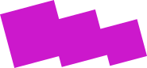

  

    
  

  

    

  

  

    

  

  

    

  

  

    <h1 style="font-size:3rem;margin-top:0.3em;" >&nbsp; Libre  Graphics  Meeting  2019</h1>
    

  

  

    

  

  

    

  

## Summer 2019 –  Saarbrücken (Germany)

The Libre Graphics Meeting (LGM) is an annual international convention for the discussion of free and open source software used with graphics. The first Libre Graphics Meeting was held in March 2006.

### Get involved for the 2019 edition!
* [Etherpad](http://pads.osp.kitchen/p/LGM2019)
* [Libre Graphics Meeting mailing list](https://lists.freedesktop.org/mailman/listinfo/libre-graphics-meeting)
